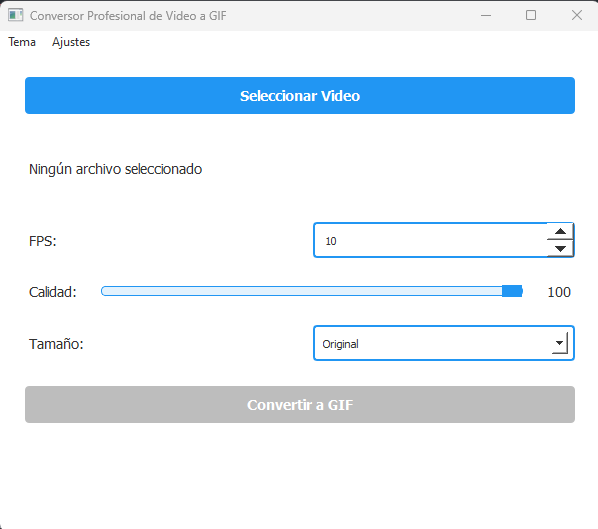
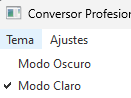
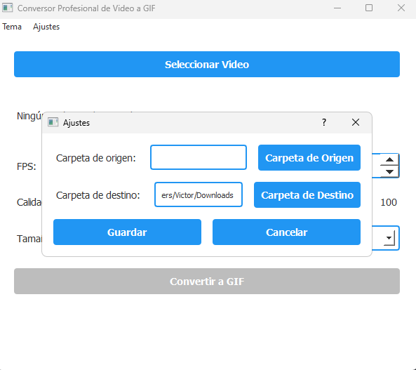

# Video to GIF Converter

Una aplicación de escritorio profesional para convertir videos a GIF con opciones avanzadas de personalización.

## Características

- Interfaz gráfica moderna con modo claro y oscuro
- Opciones avanzadas de conversión:
  - Control preciso de FPS
  - Ajuste de calidad con optimización
  - Múltiples opciones de resolución de salida
- Gestión de carpetas de origen y destino
- Guardado automático de configuraciones
- Conversión optimizada mediante FFmpeg

## Capturas

### Principal

### Tema

### Ajustes

## Requisitos

- Python 3.6 o superior
- PyQt5
- moviepy

## Uso

1. Ejecuta la aplicación:
2. Configure las carpetas de origen y destino en el menú "Ajustes" (opcional)
3. Seleccione un video usando el botón "Seleccionar Video"
4. Ajuste las opciones de conversión según sus necesidades
5. Haga clic en "Convertir a GIF"

## Configuración

La aplicación gestiona automáticamente:
- Rutas de carpetas de origen y destino
- Configuraciones de conversión (FPS, calidad, tamaño)
- Preferencia de tema de interfaz

Las configuraciones se almacenan en formato JSON y en el registro del sistema.

## Reconocimientos

- PyQt5 por el framework de interfaz gráfica
- moviepy por el procesamiento de video
- FFmpeg por la optimización de GIF